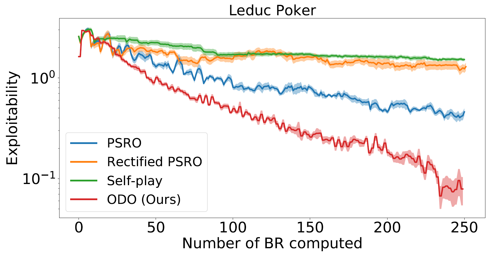
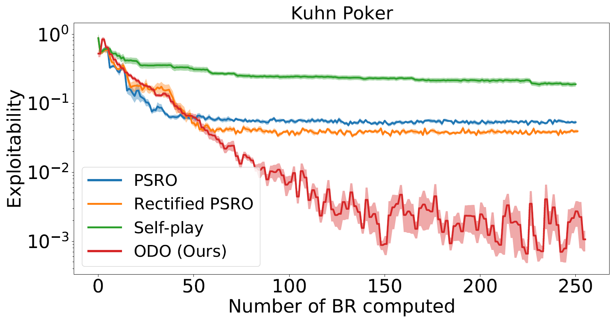

# Online Double Oracle

### Online Double Oracle

> Online Double Oracle (ODO) is a new learning algorithms for two-player zero-sum games where the number of pure strategies is huge or even infinite. Specifically, we combine no-regret analysis from online learning with double oracle methods from game theory. ODO achieves the regret bound  with k is the size of the effective strategy set which is linearly dependent on the support size of Nash equilibrium. 

Le Cong Dinh, Yaodong Yang, Zheng Tian, Nicolas Perez Nieves, Oliver Slumbers, David Henry Mguni, Haitham Bou Ammar, Jun Wang (2021) Online Double Oracle [https://arxiv.org/pdf/2103.07780.pdf](https://arxiv.org/pdf/2103.07780.pdf) 


[//]: <> (Equation generated using https://latex.codecogs.com/)


### How to run Online Double Oracle

The code on this repository can be run by cloning the repository

```shell
git clone https://github.com/npvoid/OnlineDoubleOracle.git
```

The only packages required to run it are `scipy`, `numpy` and `matpltolib`


You can run Leduc Poker by executing

```shell
python3 main_leduc.py
```

You can run Kuhn Poker by executing

```shell
python3 main_kuhn.py
```

## Leduc Poker



## Kuhn Poker

